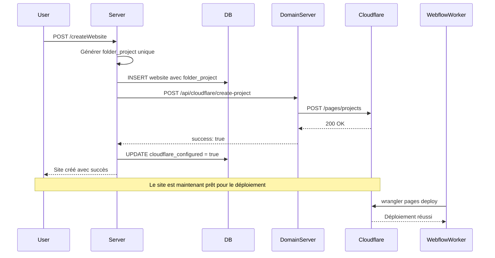

# Création Automatique de Projet Cloudflare Pages

## Vue d'ensemble

Lors de la création d'un nouveau site web dans le système, un projet Cloudflare Pages est automatiquement créé. Cela garantit que :

1. Le site a immédiatement son URL `.pages.dev`
2. Le `folder_project` est unique et défini dès le départ
3. Le workflow d'importation Webflow peut fonctionner automatiquement
4. Pas besoin d'attendre le premier déploiement pour avoir le projet Cloudflare

## Flux de création

### 1. Création du site web (POST `/createWebsite`)

```javascript
// Génération automatique du folder_project
const timestamp = Date.now();
const sanitizedSlug = website_slug
  .toLowerCase()
  .replace(/[^a-z0-9]/g, '-')
  .replace(/-+/g, '-')
  .substring(0, 20);
const folder_project = `site-${sanitizedSlug}-${timestamp}`;
```

**Format du folder_project** : `site-{slug}-{timestamp}`
- `site-` : Préfixe pour identifier les projets générés
- `{slug}` : Version sanitized du slug (max 20 caractères)
- `{timestamp}` : Timestamp pour garantir l'unicité

**Exemple** : `site-mon-site-1234567890123`

### 2. Appel au domain-server

Le serveur principal appelle immédiatement le domain-server :

```javascript
POST http://localhost:3003/api/cloudflare/create-project
{
  "project_name": "site-mon-site-1234567890123",
  "website_id": "uuid-du-site"
}
```

### 3. Création du projet Cloudflare

Le domain-server crée le projet via l'API Cloudflare :

```javascript
POST https://api.cloudflare.com/client/v4/accounts/{accountId}/pages/projects
{
  "name": "site-mon-site-1234567890123",
  "production_branch": "main"
}
```

### 4. Résultat

- ✅ Site créé dans la base de données avec `folder_project`
- ✅ Projet Cloudflare Pages créé
- ✅ URL disponible : `site-mon-site-1234567890123.pages.dev`
- ✅ `cloudflare_configured` = `true`

## Avantages

### Pour l'utilisateur
- URL de prévisualisation immédiatement disponible
- Pas de configuration manuelle nécessaire
- Expérience plus fluide

### Pour le système
- **Importation Webflow automatique** : Le projet existe déjà, le worker peut directement déployer
- **Cohérence** : Le `folder_project` ne change jamais
- **Prêt pour le déploiement** : Pas besoin de créer le projet au premier deploy
- **Gestion des domaines personnalisés** : Le projet existe déjà pour ajouter des custom domains

### Pour le workflow Webflow
```javascript
// L'importation Webflow peut directement déployer
// car le projet existe déjà
wrangler pages deploy ./dist --project-name=site-mon-site-1234567890123
```

## Gestion des erreurs

### Projet existe déjà
Si le projet existe déjà (code 8000007), on considère que c'est un succès :

```javascript
if (error.response?.data?.errors?.[0]?.code === 8000007) {
  return { success: true, already_exists: true };
}
```

### Échec de création Cloudflare
Si la création échoue, le site est quand même créé dans la BDD. Le projet Cloudflare sera créé lors du premier déploiement.

```javascript
catch (cfError) {
  console.error('⚠️ Erreur création projet Cloudflare:', cfError.message);
  // On continue quand même, le projet sera créé au premier déploiement
}
```

## Routes API

### domain-server

#### POST `/api/cloudflare/create-project`
Crée un nouveau projet Cloudflare Pages

**Body:**
```json
{
  "project_name": "site-mon-site-1234567890123",
  "website_id": "uuid"
}
```

**Response:**
```json
{
  "success": true,
  "message": "Projet site-mon-site-1234567890123 créé avec succès",
  "project_name": "site-mon-site-1234567890123",
  "website_id": "uuid",
  "pages_url": "site-mon-site-1234567890123.pages.dev"
}
```

#### GET `/api/cloudflare/project-exists/:projectName`
Vérifie si un projet existe

**Response:**
```json
{
  "success": true,
  "exists": true,
  "project_name": "site-mon-site-1234567890123"
}
```

## Base de données

### Table `websites`
Nouvelles colonnes utilisées :

```sql
- folder_project: VARCHAR -- Nom unique du projet Cloudflare Pages
- cloudflare_configured: BOOLEAN -- Indique si le projet Cloudflare est créé
```

## Migration des sites existants

Pour les sites créés avant cette modification qui n'ont pas de `folder_project` :

```sql
-- Script de migration (à exécuter si nécessaire)
UPDATE websites 
SET folder_project = CONCAT('site-', LOWER(REGEXP_REPLACE(website_slug, '[^a-zA-Z0-9]', '-', 'g')), '-', EXTRACT(EPOCH FROM created_at)::bigint)
WHERE folder_project IS NULL;
```

## Configuration requise

### Variables d'environnement domain-server
```env
CLOUDFLARE_API_TOKEN=your_token
CLOUDFLARE_ACCOUNT_ID=your_account_id
```

### Variables d'environnement server
```env
DOMAIN_SERVER_URL=http://localhost:3003
```

## Workflow complet



## Tests

### Créer un site et vérifier
```bash
# 1. Créer un site
curl -X POST http://localhost:3002/createWebsite \
  -H "Authorization: Bearer YOUR_TOKEN" \
  -H "Content-Type: application/json" \
  -d '{
    "website_name": "Mon Site Test",
    "website_slug": "mon-site-test"
  }'

# 2. Vérifier dans les logs du domain-server
# Vous devriez voir :
# [Cloudflare] Création du projet Pages: site-mon-site-test-1234567890
# [Cloudflare] ✅ Projet site-mon-site-test-1234567890 créé avec succès

# 3. Vérifier que le projet existe
curl http://localhost:3003/api/cloudflare/project-exists/site-mon-site-test-1234567890
```

## Conclusion

Cette approche garantit que chaque site web a immédiatement son infrastructure Cloudflare prête, permettant une automatisation complète du workflow d'importation Webflow et une meilleure expérience utilisateur.
